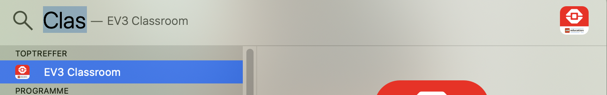

# Einführung

## Prüfungstermine

**10.11.2021 Prüfung Programmieren**

**26.01.2022 EV3 Projekt**

## Bau des EV3 🤖 



## Lego Classroom

Öffne die Classroom-App. Am einfachsten geht das über die Spotlight-Suche. Drücke CMD + Leertaste, tippe Classroom ein und drücke dann die Enter-Taste.  

### Verbindung mit dem EV3

Jetzt müssen wir uns noch mit dem EV3 verbinden:

Aktiviere Bluetooth auf dem EV3 und beim iMac. Gehe dann wie von Classroom vorgegeben vor.

### Ein erstes Programm!

Jetzt geht's los 😀. Klicke dein erstes Programm nach Anleitung zusammen:  

## Ausgänge ausprobieren

Gehe in EV3 Classroom zur nächsten Aufgabe:

